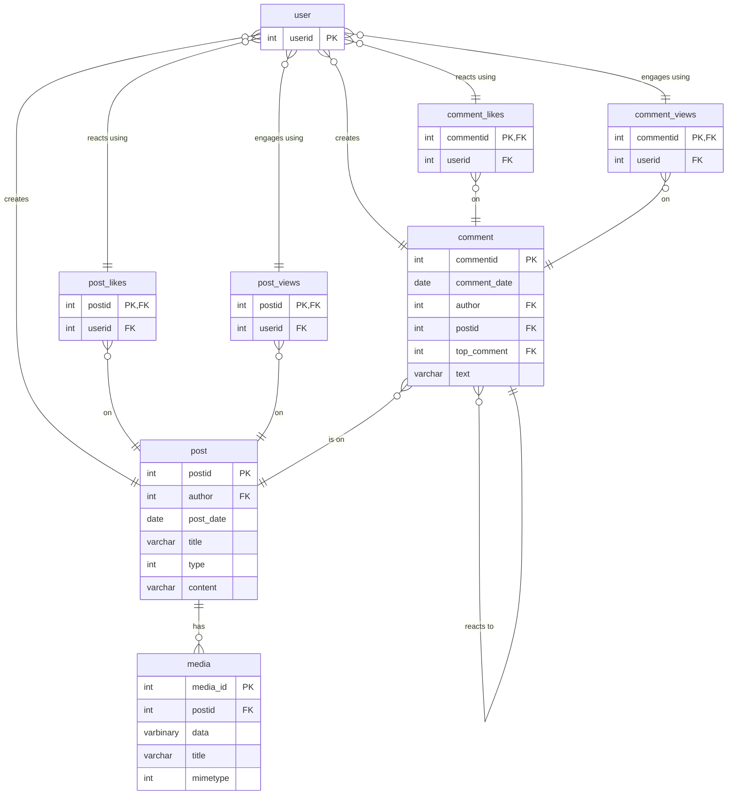

```mermaid
erDiagram
	user {
		int userid PK
	}

	post {
		int postid PK
		int author FK
		date post_date
		varchar title
		int type
		varchar content
	}

	media {
		int media_id PK
		int postid FK
		varbinary data
		varchar title
		int mimetype
	}

	post_likes {
		int postid PK,FK
		int userid FK
	}

	post_views {
		int postid PK,FK
		int userid FK
	}

	post ||--o{ media : has
	user }o--|| post : creates
	user }o--|| post_likes : "reacts using"
	user }o--|| post_views : "engages using"
	post_likes }o--|| post : on
	post_views }o--|| post : on

	comment {
		int commentid PK
		date comment_date
		int author FK
		int postid FK
		int top_comment FK
		varchar text
	}

	comment_likes {
		int commentid PK,FK
		int userid FK
	}

	comment_views {
		int commentid PK,FK
		int userid FK
	}

	user }o--|| comment : creates
	comment }o--|| post : "is on"
	comment }o--|| comment : "reacts to"
	user }o--|| comment_likes : "reacts using"
	user }o--|| comment_views : "engages using"
	comment_likes }o--|| comment : on
	comment_views }o--|| comment : on
```
