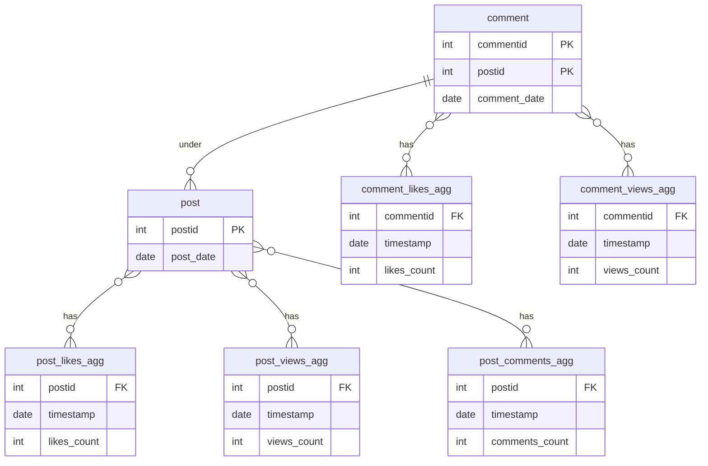

```mermaid
erDiagram
	post {
		int postid PK
		date post_date
	}

	post_likes_agg {
		int postid FK
		date timestamp
		int likes_count
	}

	post_views_agg {
		int postid FK
		date timestamp
		int views_count
	}

	post_comments_agg {
		int postid FK
		date timestamp
		int comments_count
	}

	comment {
		int commentid PK
		int postid PK
		date comment_date
	}

	comment_likes_agg {
		int commentid FK
		date timestamp
		int likes_count
	}

	comment_views_agg {
		int commentid FK
		date timestamp
		int views_count
	}

	post }o--o{ post_likes_agg : has
	post }o--o{ post_views_agg : has
	post }o--o{ post_comments_agg : has
	comment }o--o{ comment_likes_agg : has
	comment }o--o{ comment_views_agg : has
	comment ||--o{ post : "under"
	
```

