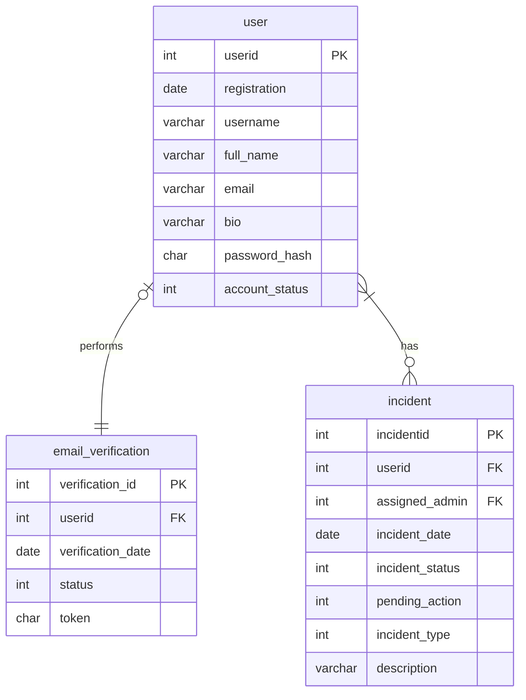

```mermaid
erDiagram
	user {
		int userid PK
		date registration
		varchar username
		varchar full_name
		varchar email
		varchar bio
		char password_hash
		int account_status
	}

	email_verification {
		int verification_id PK
		int userid FK
		date verification_date
		int status
		char token
	}

	incident {
		int incidentid PK
		int userid FK
		int assigned_admin FK
		date incident_date
		int incident_status
		int pending_action
		int incident_type
		varchar description
	}

	user |o--|| email_verification : "performs"
	user }|--o{ incident : "has"
```

